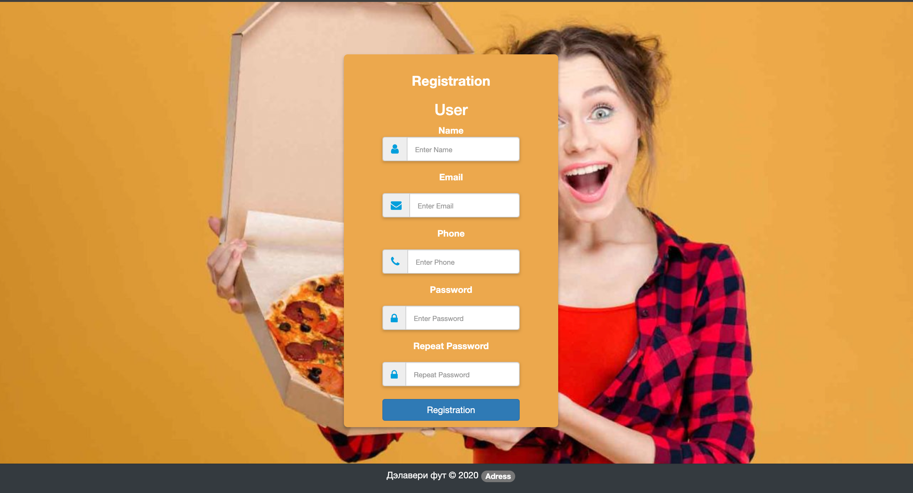
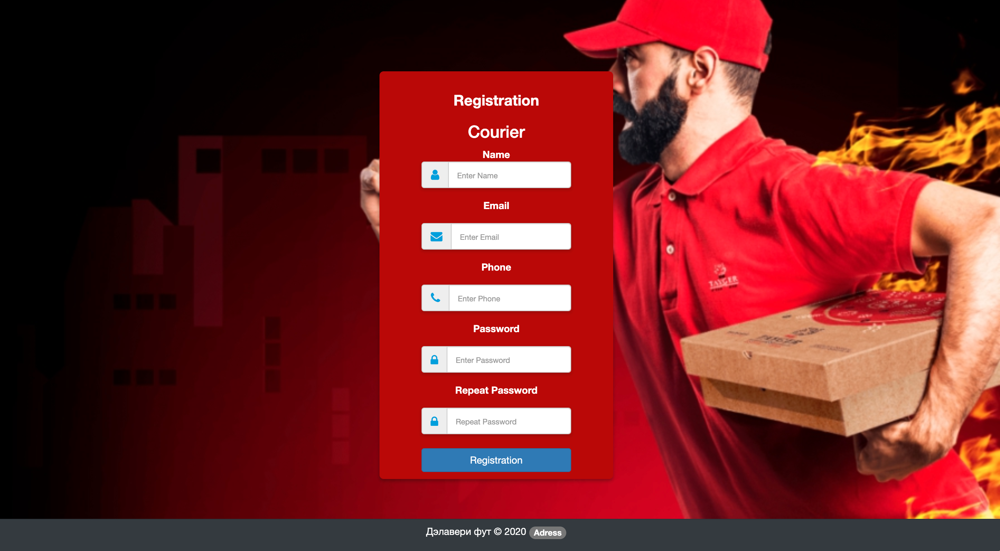
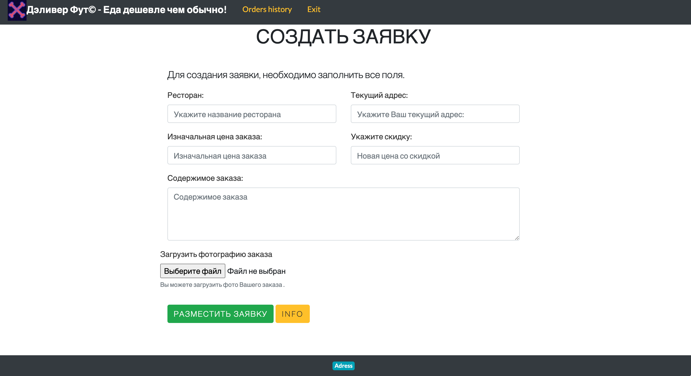
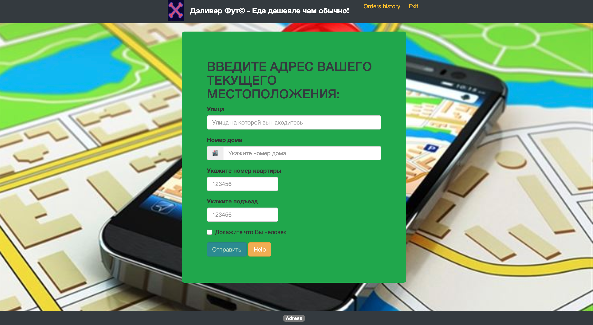

# Deli-food

## Сервис по доставке не доставленной пищи!

## Start application 

* npm i
* npm start 

### Аутентификация 

Возможность зарегистрироваться за пользователя или за курьера.
### Страница пользователя 

### Страница курьера  

### Возможность составить подробное описание заказа для курьера, которое будет отображаться в списке возможных заказов пользователя.

### Указание местоположения для фильтрации возможных заказов поблизости

### В обоих аккаунтах возможно отслеживание истории доставленных и выбранных заказов. 
### Так же присутствует для более быстрого принятия заказа оповещение по email, для пользователя и курьера.

### В ближайшее время планируется добавить yandex map api, работа с дизайном приложения.

### В разработке проекта участвовали
[Никита Ламбин](https://github.com/LamNik324)
[Дмитрий Тугаев](https://github.com/Dmitriy-mrx)
[Роман Сахнин](https://github.com/romaperlos)

